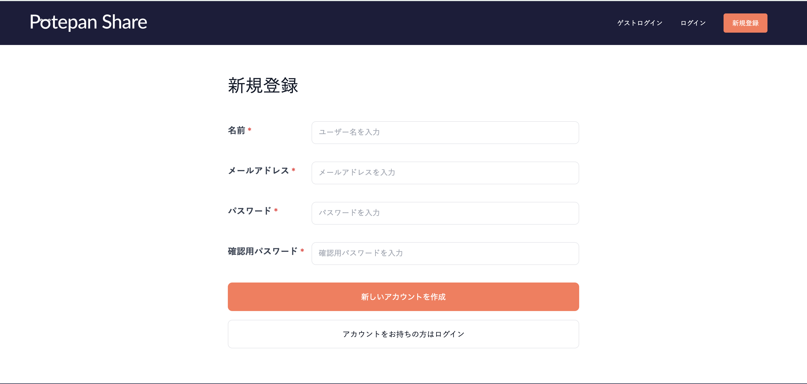
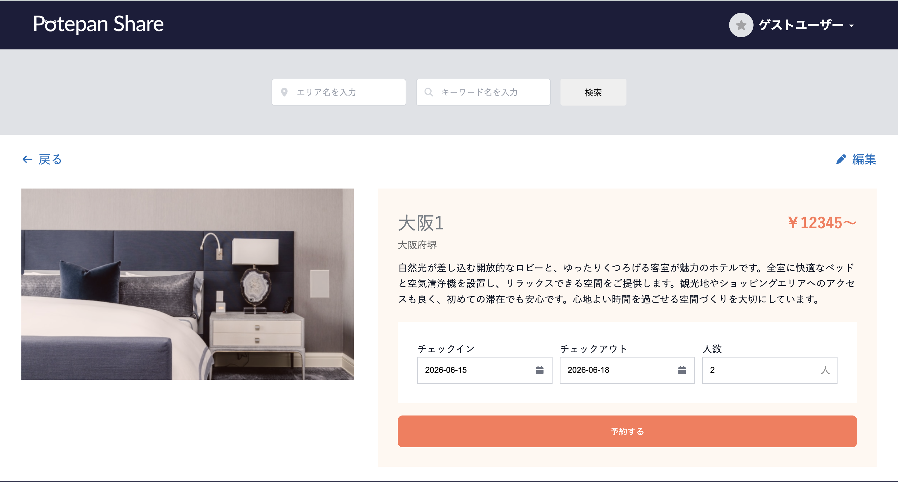
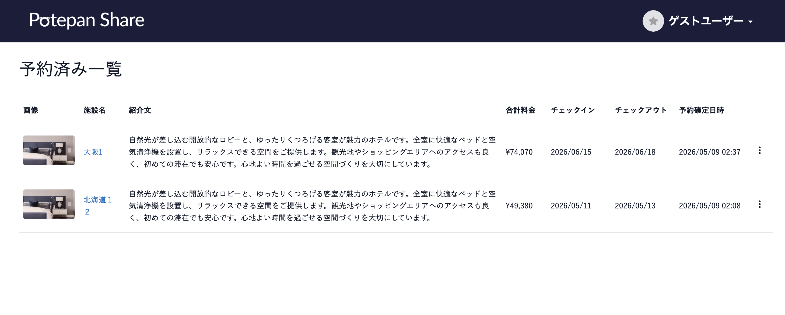
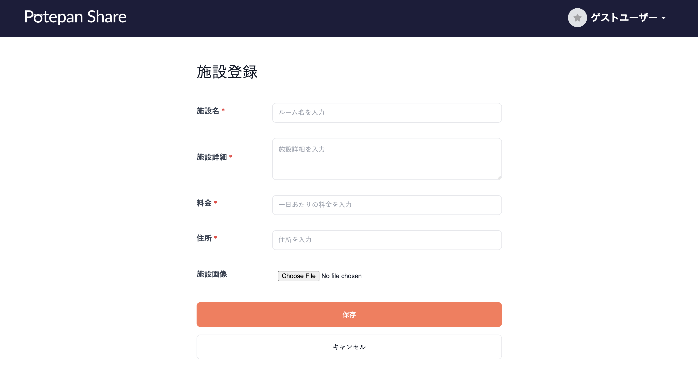

# PotepanShare

PotepanCampの最終課題で制作した宿泊施設の予約、登録システムです。

🔗 Live Demo  
https://potepanshare.onrender.com

## 🌐 アプリ概要

PotepanShareは

* 宿泊施設の登録、管理
* 宿泊施設の予約

のためのWebアプリです。

「誰でも簡単に宿泊施設を探して予約できるシンプルな体験」
「個人でも宿泊施設を登録・管理できるAirbnb風サービス」

をコンセプトに設計しています。


## 主な機能

### 🔐 ユーザー機能
ユーザー登録 / ログイン（Devise）
ゲストログイン
プロフィール編集

### 🏠 宿泊施設機能
宿泊施設の登録 / 編集 / 削除
画像アップロード
宿泊施設詳細表示
エリア検索機能

### 📅 予約機能
宿泊施設の予約
予約日数・人数入力
予約一覧確認

### 🎨 UI / UX

* シンプルで直感的なUI設計
* favicon / アプリアイコン実装


## 🛠 技術スタック

| Category        | Technology            |
| --------------- | ----------------------|
| Backend | Ruby on Rails 7 |
| Authentication | Devise |
| Database | Neon (Production) / SQLite3 (Development) |
| Storage | ActiveStorage (Development) / Cloudinary (Production) |
| Frontend | HTML / CSS / JavaScript |
| Environment | Docker |
| Version Control | Git / GitHub |


## 🧱 アーキテクチャ
MVC構成（Rails）


## 🚀 セットアップ方法

```bash
git clone https://github.com/miraisato-dev/potepanShare.git
cd potepanShare
bundle install
rails db:create db:migrate
rails s
```

ブラウザで以下にアクセス：

```
http://localhost:3000
```


## 👤 ゲストログイン

ログイン画面から **ゲストログイン** を利用することで、アカウント登録なしで機能を確認できます。


## 🎯 開発背景

PotepanCampの最終課題として、
宿泊施設の登録・予約機能を持つWebアプリを開発しました。

RailsでのCRUD処理や認証機能、
画像アップロード、Cloudinary、Neonを利用したファイル管理など、
実践的なWebアプリ開発を学ぶことを目的に制作しました。


## 💡 工夫した点

* ゲストログイン機能を実装し、登録なしでもサービス体験できるようにした（離脱防止のため）
* 開発環境ではActiveStorage、本番環境ではCloudinaryを使い分けて画像アップロードを最適化
* 検索機能でエリア別に宿泊施設を絞り込み可能にした
* UIをシンプルにして直感的に操作できる設計にした

## 🔮 今後の改善予定

* カレンダーのデザインを変更
* 京都と東京都のバリデーションをしっかりすること
* 画像のアップロードが遅い

## 📸 スクリーンショット

* トップページ

* ログイン / 新規登録

* 施設一覧

* 施設詳細 / 予約画面

* 予約一覧

* プロフィールページ

* 施設登録画面



## 👨‍💻 作者

miraisato-dev
GitHub: https://github.com/miraisato-dev
